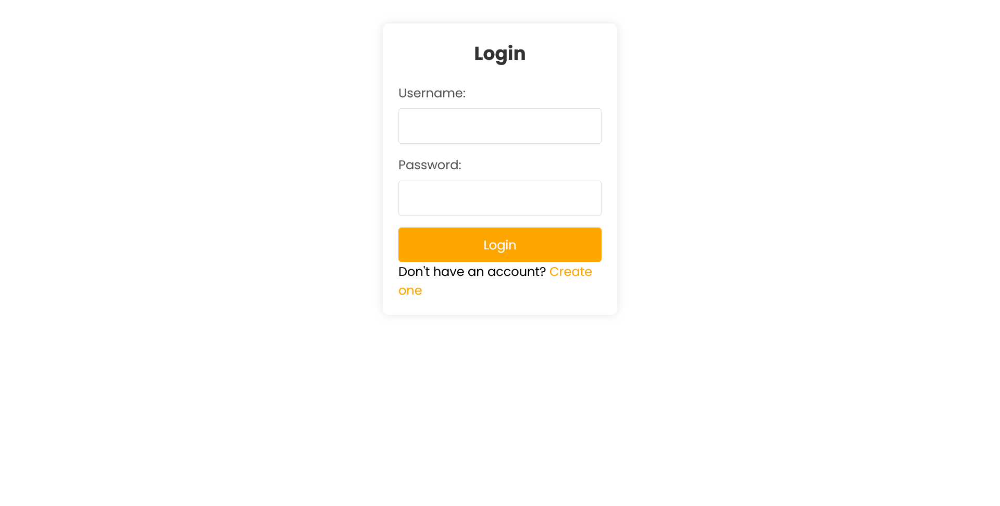
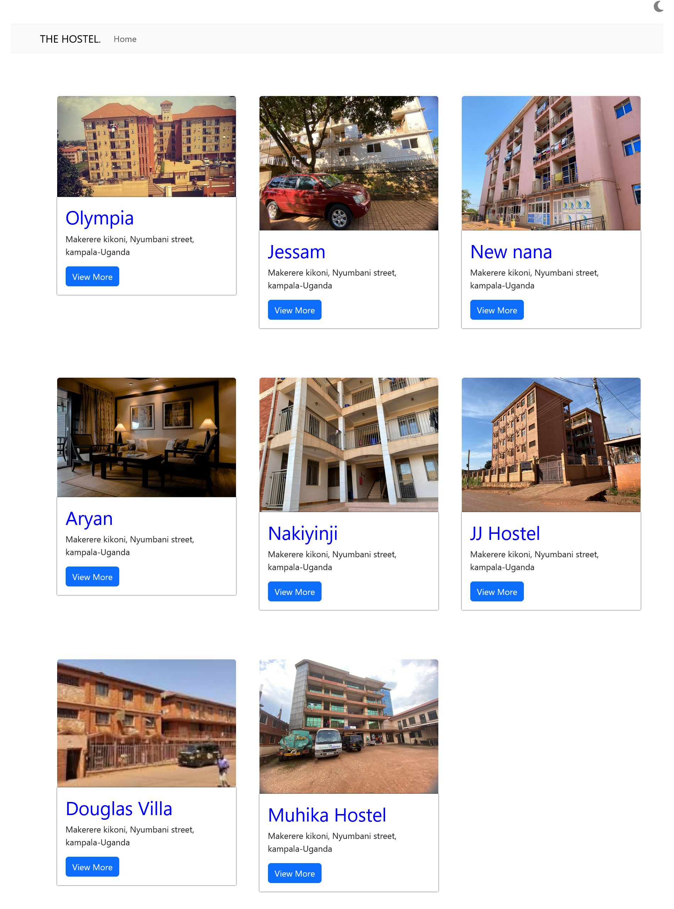
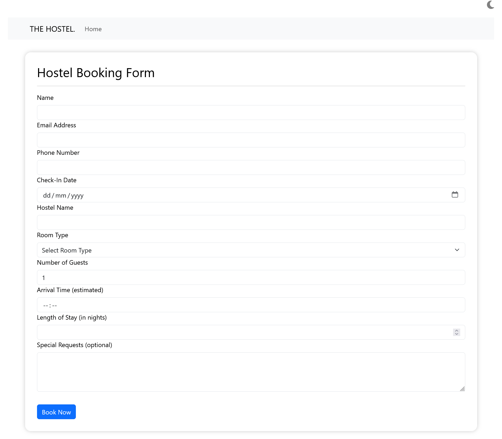

This project was made using react and Json server to handle user verifications 
 
To run the application you need to have Node.js installed on your machine,
  
1. Clone this repository by running command in terminal.
 
inorder to have this project locally onto your device.
screen shoots of how this project looks like
 
  

 

 
